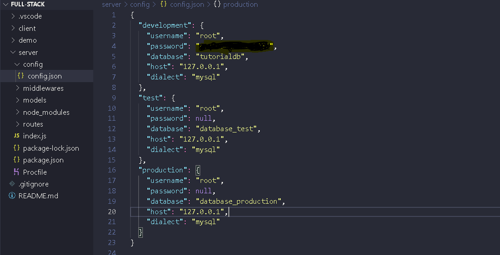
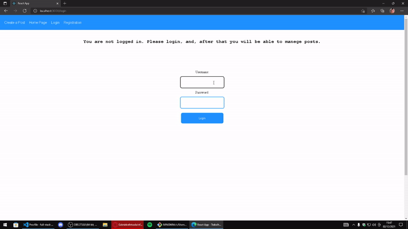
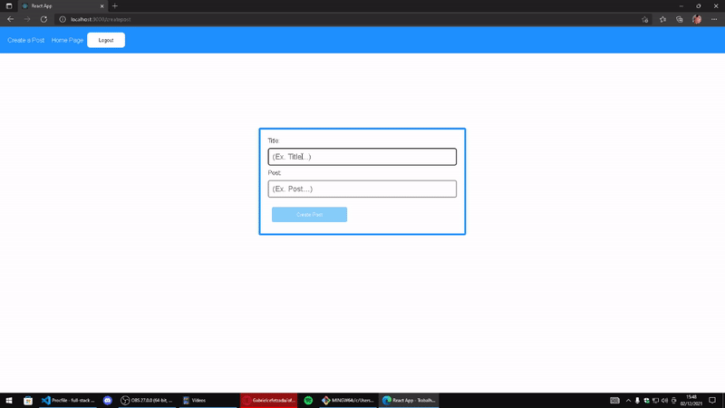
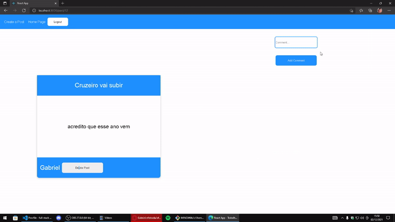
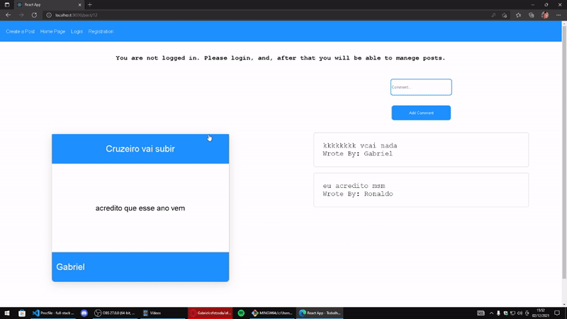

## You must have this sequelize configuration to run this app:

## Here you can login and register 

## Post cool stuff!

## Comment in the posts! 

## And delete posts if you are the creator of them

## Learned and practiced 

- CRUD with node
- Authentication and Authorization with Node
- Json Web Tokens
- Local Storage
- Consuming API's
- Props
- Context API
- ORM Sequelize for database
